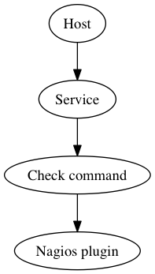
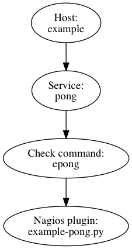
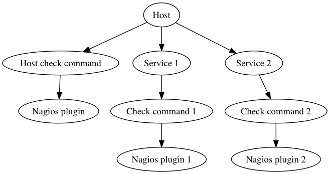

#Installing a new nagios plugin on tacmon


##Quick overview first





In this example I describe how to configure monitoring for a new imaginary remote service called "example". Multiple check commands might be used to check the various capabilities of  "example". I will just describe how to monitor 
"pong" on "example"



## A new check command - example-pong.py

For the purposes of this example I have made up a plugin called ```example-pong.py``` This imaginary plugin pongs a remote host and will return a status of OK, WARN or CRIT depending on how long (if at all) the host takes to respond. The following command line options are accepted:

```
tacmon $ ./example-pong.py -h
-h					#Help
-H <DNS Name>	#Where to point the ponger
-w <number>		#Time in milliseconds above which a WARN status is returned.
-c <number>		#Time in milliseconds above which a CRIT status is returned.
```

And the plugin is used as follows:

```
tacmon $ ./example-pong.py -H 8.8.8.8 -w300 -c500
pong OK - Host responded in 60ms | time=60
tacmon $ ./example-pong.py -H 9.9.9.9 -w300 -c500
pong WARN - Host responded in 400ms | time=400
tacmon $ ./example-pong.py -H 4.4.4.4 -w300 -c500
pong CRIT - Host responded in 600ms | time=600
```

- Drop the new plugin into ```/opt/tacmon/icinga2/plugins/``` 
- Check if the plugin will execute using the system python environment. 

```
Tacmon $ /opt/tacmon/icinga2/plugins/example-pong.py
<<not a python Whoopsie..>>
tacmon $
```

##Create new Icinga2 check command - epong

- Introduce the new plugin to icinga (this example assumes that the system python environment works with this plugin.) The ```-W ignore``` is used to ensure that no warnings are issued by Python. The file to edit is ```/usr/share/icinga2/include/command-plugins.conf``` Just add to the end of it.

```
CheckCommand "epong" {
        import "plugin-check-command"
        command = ["/usr/bin/python", "-W", "ignore", "/opt/tacmon/icinga2/plugins/example-pong.py"]
        arguments = {
        	"-H" = {
        		value = "$epong_address$"
			description = "Host name, IP Address, or unix socket (must be an absolute path)"
        	}
        	"-w" = {
        		value = "$epong_wtime$"
        		description = "Warning threshold in MilliSeconds"
        	}
        	"-c" = {
        		value = "$epong_ctime$"
        		description = "Critical threshold in MilliSeconds"
        	}
        }
}
```
the variables ```$epong_address$``` ```$epong_wtime$``` ```$epong_ctime$``` are set in the host definition - see below.

It is probably worthwhile checking your icinga2 config at this point:

```
# service icinga2 configcheck
```

(something like that..)

##Create a new service called pong

- Create a service called pong in ```/etc/icinga2/conf.d/services.conf```

```
apply Service "pong" {
  import "generic-service"

  check_command = "epong"
  
  assign where host.epong
}
```

Here I have defined a new service called ```pong```. Pong inherits things like execution interval from the service ```generic-service``` I assign it to hosts which have the variable ```pong``` set.

At this point, depending how you write the service, the Icinga2 configuration might not pass validation due to dependencies on hosts which we have not defined yet.

##Create a new host called example

As with Nagios, Icinga2 expects that a check command be applied to the host. 



If we are monitoring a physical or virtual host we might choose to use ```ping``` as a host check command. If we are monitoring a group of SaaS services (for example like those presented by Seachange) we might choose to make the host check a no-op command - we are only using the host as an organisational container for the services. In the setup at BBCWW Store I override the ```generic-www``` service, so including it is useful for monitoring remote groups of services. However, in this example I only configure a single service.

The Host is defined in ```/etc/icinga2/conf.d/hosts.conf```

```
object Host "example" {
  import "generic-www"
  epong = true
  epong_address = "8.8.8.8"
  epong_wtime = 200
  epong_ctime = 500
  }
  ```
  
With that final flourish the configuration has been completed, reload the icinga2 service. It will let you know where you have made mistakes..

#PLEASE NOTE
This is from memory - I have not tested it yet.. 